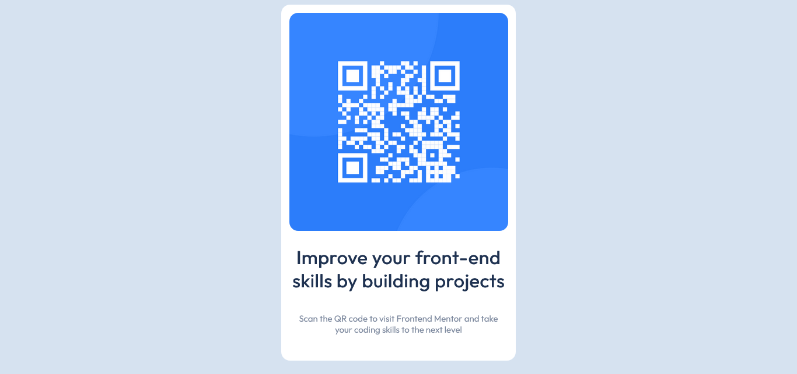

# Frontend Mentor - QR code component solution

This is a solution to the [QR code component challenge on Frontend Mentor](https://www.frontendmentor.io/challenges/qr-code-component-iux_sIO_H). Frontend Mentor challenges help you improve your coding skills by building realistic projects. 

## Table of contents

- [Overview](#overview)
  - [Screenshot](#screenshot)
  - [Links](#links)
- [My process](#my-process)
  - [Built with](#built-with)
  - [What I learned](#what-i-learned)
  - [Continued development](#continued-development)
- [Author](#author)

## Overview

### Screenshot

### Links

- Solution URL: [Solution url](https://spit-fires.github.io/QR-code-component/)

## My process

### Built with

- HTML CSS

### What I learned

I learned how to use the CSS grid and flexbox to create a responsive layout.

### Continued development

In the future I plan to implement this card in my Sveltekit component library.

## Author

- Frontend Mentor - [@Spit-fires](https://www.frontendmentor.io/profile/Spit-fires)
